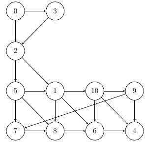

# Depth-First Search

As opposed to the conservative approach of BFS (where
the algorithm looks at known nodes and their value before exploring further),
DFS is the opposite, whenever it finds a node, it will explore the best option immediately.

DFS marks a node that has been visited, initially, all nodes are unmarked.

The algorithm starts at a given node and from there on out it
looks for the neighboring node with the minimal value that has not been visited yet.

From that node, it repeats the first step until there is no such node to be found.
If that is the case the algorithm backtracks until it finds a node that has not been 
visited yet.

Example: DFS in action starting at node 0

0 -> look for the minimal neighbor that has not been visited yet -> 2

2 -> look -> 1

1 -> look -> 6

6 -> look -> 4

4 -> no neighbor available, backtrack to last node and look -> backtrack again -> 8

8 -> backtrack to 1 -> look -> 10

10 -> look -> 9

9 -> look -> 7

7 -> backtrack x4 to 2 -> look -> 5

5 -> backtrack x2 to 0 -> look -> 3

Final visitation order: 0, 2, 1, 6, 4, 8, 10, 9, 7, 5, 3
