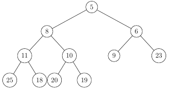
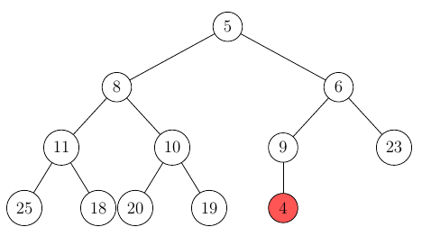
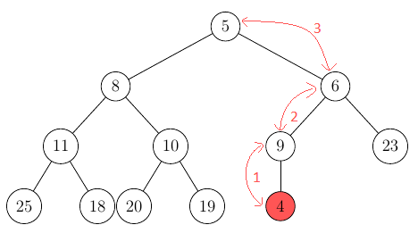
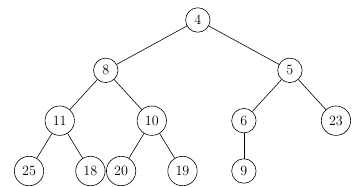
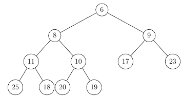
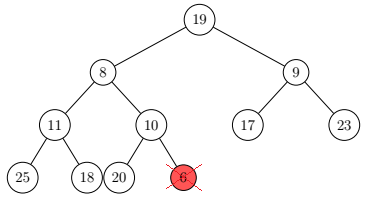
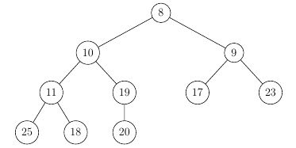

# Binary Heaps

Binary Heaps are a kind of priority Queue, that always
take the shape of a binary tree. The tree
can be complete (`(n+1)/2` leafs) or the last level of the 
tree is incomplete, but the tree is filled from left
to right.

Example of a valid Binary Heap:

As you can see there is another special invariant present in the
heap, the root of a (sub-)tree carries the minimal value in
that tree. If this is the case the heap is called a min-heap
(max-heap otherwise).

## Insertion (example: 4)
When inserting a node into the heap, you have to first 
add it as a leaf at the first available position:

Afterwards, we need to make sure the invariant of the minimal
value as the root is guaranteed, to do this, we compare
the inserted node with its parent and swap the two if the parent
is bigger (smaller in a max-heap).

This operation of swapping the node until it is at its 
proper place is called siftUp() or (min/max)-heapify.
 
After we finished, the parent of the inserted node is either 
smaller, or the node is the root (the latter in this case).

## Removing the root

The point of priority Queues is that you always have a fairly
simple and fast way to get to the element with the highest
priority. In a Binary heap, this element is always the 
root node.

Removing the root is simple, you just swap it with the
last leaf in the tree, delete it and then sift 
the new root down if the priority of one of the children is 
higher.

Example:

When removing the root out of this heap, you would
1. Swap it with the last leaf (19)
2. Delete 6 from its new leaf position
3. Swap 19 with its minimal child until the invariant
is re-established

Step 1 and 2 (Swap and Deletion):

Step 3 (Sift):

So after the entire deleteRoot() operation we're left with 
a valid binary heap again:

## HeapSort
Because of how these priority queues operate and their relative
efficiency, they are quite useful for things like sorting algorithms.

As you might guess, if you insert `n` elements into the binary heap and then
remove the root `n` times, you can sort these elements based on their
priority. This algorithm is called heapsort.

As you can extract from the table below, the insertion into a tree
works in `O(1)` time, the deletion in `O(log n)`. Thus
the insertion and subsequent deletion of n elements (HeapSort)
works in a worst-case time of `O(n log n)`

## Time Complexity:

| Search  | Insertion  | Deletion  |
|----|----|----|
| `O(n)` | `O(1)` | `O(log n)` |
